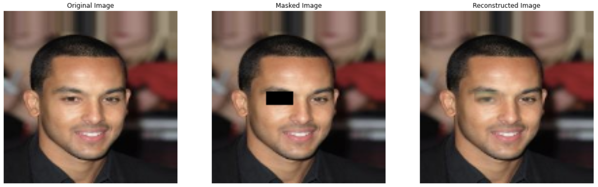
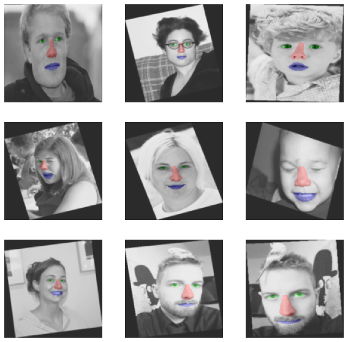

# tinkering-ml

My repertoire of ML/DS related exploration

## Project List

- Computer Vision
  - [Recursive PCA Face Inpainting](computer_vision/recursive_pca_face_inpainting/)
    
    

  - [Face Attribute Segmentation](computer_vision/face_attr_segmentation/)
    
    

- Probability Theory
  - Bayesian A/B Testing