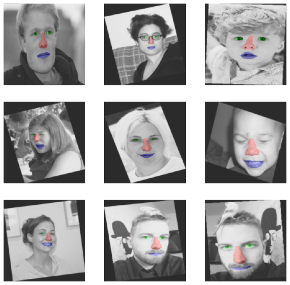

# Face Attribute Segmentation

Given some segmentation labels, a face attribute segmentation model is trained to predict pixels contained in an image with respect to their corresponding segment labels. In this project, Helen Face Dataset is used to train the segmentation model. Furthermore, the model uses UNet encoder-decoder architecture with Adam optimizer. I encountered an imbalanced dataset problem, thus, it is trained by using a weighted cross entropy loss. IoU as well as individual class precision and recall become the chosen evaluation metric.

